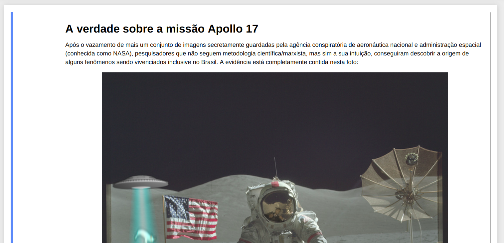

# Chroma key

[TP1](docs/tp1_enunciado.pdf) de Processamento Digital de Imagens do
DCC/UFMG em 2019/01 do grupo composto por:

- [Douglas Ludgério](https://github.com/douglaslud)
- [Flávio Coutinho](https://github.com/fegemo)
- [Ricardo de Oliveira](https://github.com/Tsuchiryu)

## Resultado final

## Documentação

Veja aqui [o que foi feito e como][explicacao], e conheça a verdade
secreta sobre a missão Apollo 17.

[][explicacao]

[explicacao]: verdade.ipynb

## Itens implementados

- [x] Substituição de cor por transparência
- [x] Mesclagem de imagens
- [x] Operações radiométricas
  - [x] Dessaturação
  - [x] Transparência
  - [x] Colorização
- [x] Transformações geométricas
  - [x] Translação
  - [x] Escala
  - [x] Rotação
  - [x] (extra) _Warping_ do raio trator (transformação projetiva)
  - [x] (extra) _Warping_ do alien (decomposição em malha poligonal)
- [x] Operações convolucionais
  - [x] Detecção de borda com Prewitt
  - [x] Borragem gaussiana
  - [x] (extra) Borragem por movimento
- [x] (extra) Operações morfológicas
  - [x] Dilatação
- [x] (extra) Texturas procedurais
  - [x] Gradiente abaulado
- [x] (extra) Sombreamento para simular iluminação da cena
- [x] (extra) Projeção de sombras
